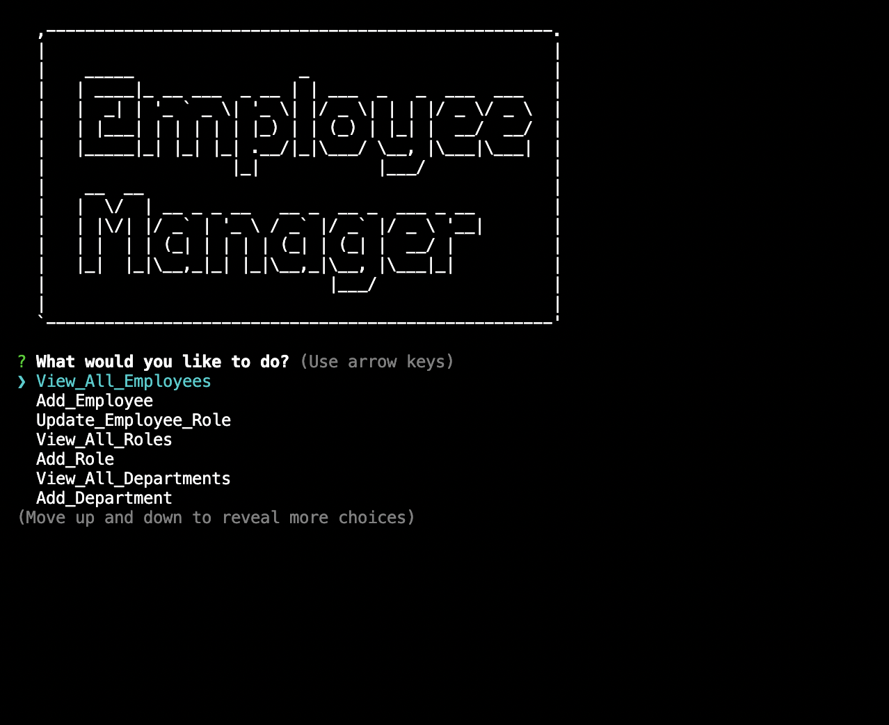

# Employee-tracker

## Description

The Employee Tracker is a content managment system (CMS) to easily view and interact with information stored in databases. It is command-line application used to manage a company's employee database, using Node.js, Inquirer, and MySQL.
- run 'node index.js' to start application in the command-line

## Usage

User can find deployed app at [GitHub](https://github.com/Babylex710/employee-tracker)

The following image shows the web application's appearance:

   

## Walkthrough Video

Walkthrough video [link](https://drive.google.com/file/d/17-D4PL_p5HgkY7muZv-drN4Vzlg90_F5/view)

